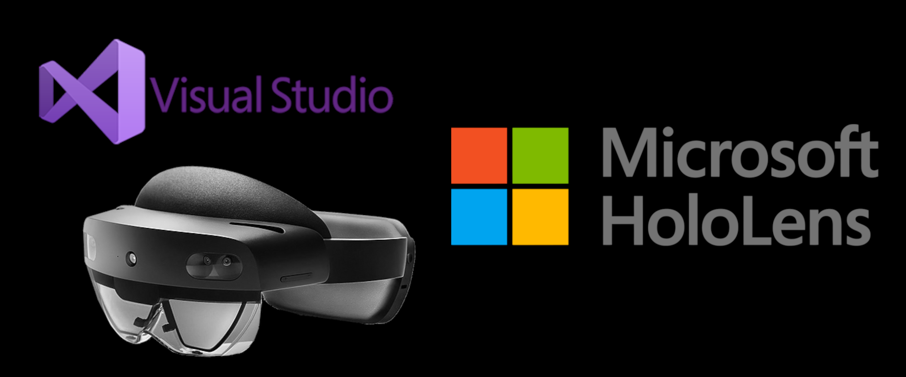
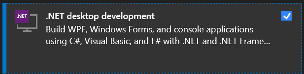
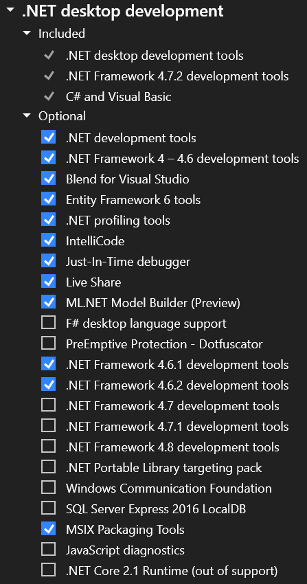
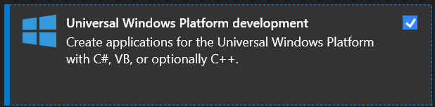
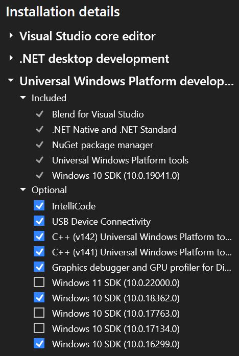
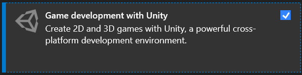
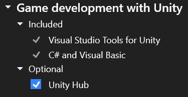

This page will help you get Visual Studio configured for building Mixed Reality applications on HoloLens. Note that the installation can take from 30 minutes to multiple hours depending on your internet connection and computer.  

## Versions Supported
Currently only [Visual Studio 2019](https://visualstudio.microsoft.com/vs/) is supported. You may use:

- Pro
- Community or
- Enterprise 

However, *VS Code is **not supported***.

## Workloads and Features
During the installation of Visual Studio, be sure to include the Workloads and Optional Features listed below.

If any Workload or Feature is missed, it can be added later by going to **Windows Settings -> Apps -> Visual Studio** and clicking the **Modify** button.

###.NET desktop development

### Universal Windows Platform development

### Game development with Unity

