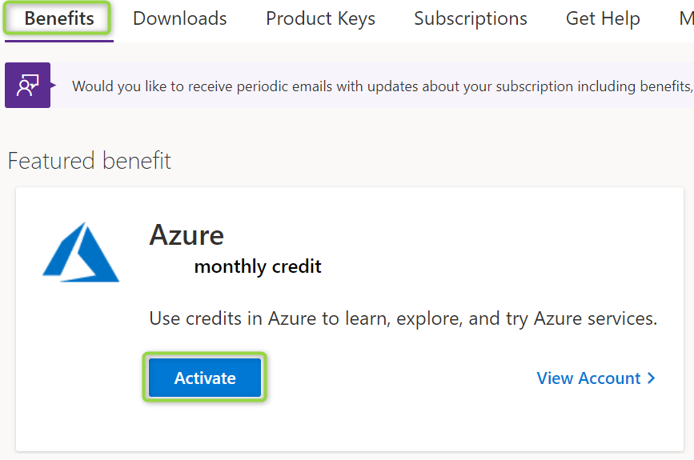

# Azure Benefits for Microsoft Employees

## Steps to activate

1. Go to https://my.visualstudio.com and sign in with your **@Microsoft.com** e-mail address and password.
1. Under Benefits, click the button to **Activate** the monthly Azure credit

1. Go to https://portal.azure.com and sign in with your **@Microsoft.com** e-mail address and password.

For more information see [Visual Studio FTE Subscriptions](https://microsoft.sharepoint.com/:w:/r/teams/AzAccess/_layouts/15/Doc.aspx?sourcedoc=%7B77835C82-96B6-4FBF-A889-53876739ACE5%7D&file=Visual%20Studio%20FTE%20Subscription%20for%20Infopedia.docx&action=default&mobileredirect=true&DefaultItemOpen=1).
