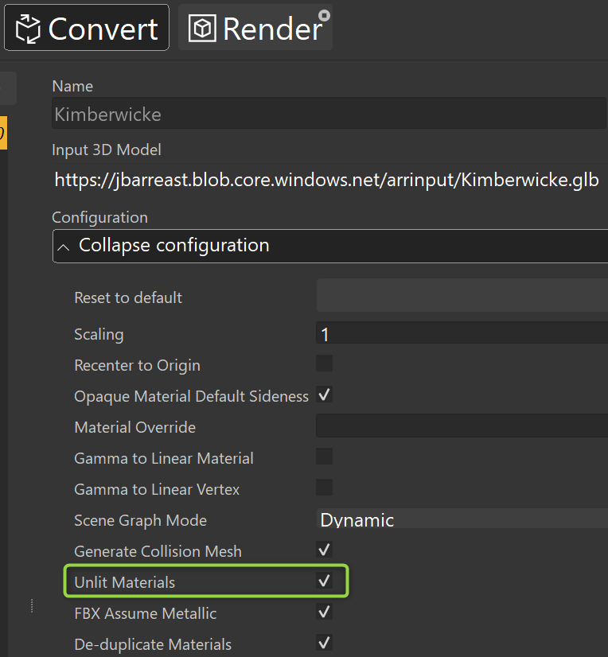

# Day 3 - Azure Remote Rendering

Welcome to **Day 3** of the **Dev and MR Services** Track! Today we'll learn about **Azure Remote Rendering** and the scenarios it opens for  partners. We'll use ARR tools, build an interactive lab, and continue working on our Team Hack projects.

## Presentation

A copy of the presentation can be downloaded here: [Azure Remote Rendering Technical Overview](https://microsoft.sharepoint.com/:p:/t/MRTechLift/ERdFiZsHTWNBnGlOus1ktlgBS9iWa_pYNPZ2KdDse_lLFw?e=2SQMpV).

**IMPORTANT:** For Microsoft employees attending TechLift 2021, the presentation above is **Internal-Only**.

## Hands-On Labs

Labs today are likely to take up to 90 minutes. We still don't recommend spending more than 90 minutes unless your team plans to extend hack time together.

Every participant should complete both labs in the [Intro](#intro-labs-required) section. These are fairly short. You should also complete one of the [Intermediate](#intermediate-labs-choose-one) labs since these are where you'll see ARR models rendering on a HoloLens device. The [Advanced](#advanced-labs-optional) labs are optional.

### Intro Labs (Required)

- [Create an Azure Remote Rendering Account](https://docs.microsoft.com/en-us/azure/remote-rendering/how-tos/create-an-account) - This lab walks you through adding Azure Remote Rendering to your own tenant.

- [Convert a Model and View it in ARRT](https://docs.microsoft.com/en-us/azure/remote-rendering/quickstarts/convert-model) - This lab walks you through converting a model for use in Azure Remote Rendering. In this lab you have the option to use PowerShell or a tool called ARRT to do the conversion. Feel free to choose either approach, but you'll want to use the ARRT after the conversion is complete to preview the converted model.

> [!Note] To complete the lab above you'll need a large 3D model - one that HoloLens can't render on it's own. Microsoft employees are welcome to use this [Matterport Scan](https://microsoft-my.sharepoint.com/:u:/p/jbienz/ERZVgYBp7FBCgcUCoUctNgQBkjqA40r3IHuFg6m4mJNSmw?e=2XI4Q9) of a home Jared used to own, but **don't distribute** this model without Jared's permission ([jbienz@microsoft.com](mailto:jbienz@microsoft.com)).

> [!IMPORTANT] If the 3D model your converting is a photogrammetry model, like the Matterport scan above, be sure to select "Unlit Materials" during conversion. Unlit doesn't mean "no light". Unlit means that light is already baked into the 3D model so other light sources should be ignored.
> 
>

### Intermediate Labs (Choose One)

- [Remote Render a model in Unity](https://docs.microsoft.com/en-us/azure/remote-rendering/quickstarts/render-model) - Now that you've converted a model, it's time to view the converted model in Unity and on a HoloLens.

- [Viewing ARR Content in Mesh App](https://docs.microsoft.com/en-us/mesh/mesh-app/use-mesh/arr-content) - Did you know that [Mesh App](https://www.microsoft.com/en-us/p/microsoft-mesh-app-preview/9p64lj74ngw0?rtc=1) has ARR built-in? And did you know that right now it's *free*? This lab shows you how to view converted ARR models inside **Mesh App**.

### Advanced Labs (Optional)

- Build and run the [Unity Showcase Application](https://docs.microsoft.com/en-us/azure/remote-rendering/samples/showcase-app) - The Showcase application is a fully featured 3D model viewer for HoloLens 2.

## Team Hacks

After labs it's time again for **Team Hacks**. Join your team channel and plan for **2.5 hours+** of hacking. Like yesterday, teams can go beyond this time at their discretion.

For reference, here are the [Project Descriptions](projects.md).

## Important Links

The most important link to bookmark for future reference is [Azure Remote Rendering documentation](https://docs.microsoft.com/en-us/azure/remote-rendering/). This page links to overviews, key concepts, tools and samples.

## 3 Down, 1 to Go

Excellent work completing Day 3. Only 1 day left to go! Spend as much time hacking as you and your team would like, and we'll see you on **Day 4!**
