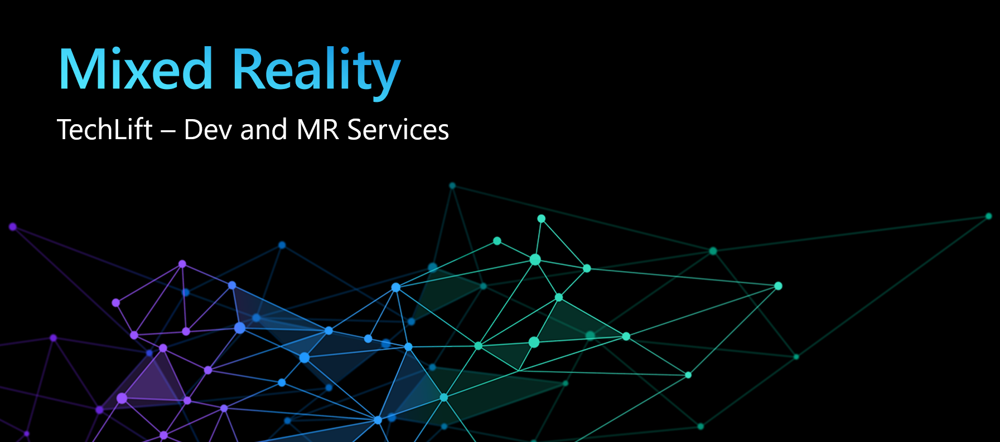

# Day 4 - Azure Object Anchors

Welcome to the final day of the **Dev and MR Services** Track! Today we'll learn about **Azure Object Anchors** and the capabilities it provides. We'll compare it to ASA, build interactive labs, and put the finishing touches on our Team Hack projects.

## Presentation

A copy of the presentation can be downloaded here: [Azure Object Anchors Technical Overview](https://microsoft.sharepoint.com/:p:/t/MRTechLift/EQrJ6FxqS8VIuFD5eyFvahcB-wjN5YqFblrlDjbpBHP27Q?e=3SFwbx).

**IMPORTANT:** For Microsoft employees attending TechLift 2021, the presentation above is **Internal-Only**.

## Hands-On Labs

Labs today are likely to take up to 90 minutes. We still don't recommend spending more than 90 minutes unless your team plans to extend hack time together.

Every participant should complete labs in the [Intro](#Intro-Labs-(Required)) section. Participants should also complete at least one of the [Intermediate](#Intermediate-Labs-(Choose-One)) labs since these are where you'll see AOA working on a HoloLens device. There are currently no Advanced labs for AOA.

### Intro Labs (Required)

- [Capture a model](ocap.md) - **Microsoft employees only:** Use an internal tool to capture an object.

- [Create an Object Anchors model for use in an app](https://docs.microsoft.com/en-us/azure/object-anchors/quickstarts/get-started-model-conversion) - This lab walks you through adding AOA to your Azure Tenant as well as converting a model for use as an Azure Object Anchor.

### Intermediate Labs (Choose One)

- [Create a HoloLens app with Unity](https://docs.microsoft.com/en-us/azure/remote-rendering/quickstarts/render-model) - Build and test a Unity app that anchor content to an Azure Object Anchor. Note that this lab repeats some steps which were already completed in the Intro lab and can be skipped.

- [Create a HoloLens app with Unity and MRTK](https://docs.microsoft.com/en-us/azure/object-anchors/quickstarts/get-started-unity-hololens-mrtk?tabs=unity-package-web-ui) - This lab includes many more features than the Unity sample above, but also requires MRTK. Note that this lab also repeats some steps which were already completed in the Intro lab and can be skipped.

## Team Hacks

It's time to complete those **Team Hacks** - only one more service to add. Join your team channel and code, code, code, code, CODE! As always, plan for **2.5 hours+** and optionally go beyond at your teams discretion.

One last time, here are the [Project Descriptions](projects.md).

## Important Links

The most important link to bookmark for future reference is [Azure Object Anchors documentation](https://docs.microsoft.com/en-us/azure/object-anchors/). As with the other services, this page includes links to overviews, concepts, and samples.

## Feedback and Thanks

Well, that's a wrap! We hope you had a great week. Please send all feedback to Jared Bienz ([jbienz@microsoft.com](mailto:jbienz@microsoft.com)) and Linda Wood ([Linda.Wood@microsoft.com](mailto:Linda.Wood@microsoft.com)). We'll collate everything and make sure it lands with the right PMs and Engineers.

Have a great weekend, and **THANK YOU** for participating in *TechLift 2021!!*
