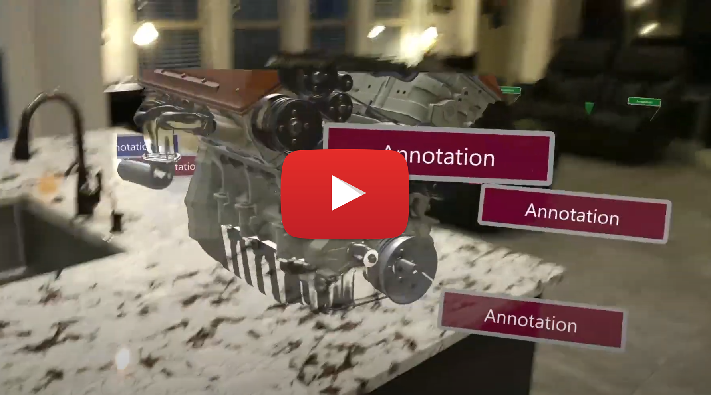

Below are the recommended projects teams can work on throughout the week. Each project is designed to incorporate a new MR Service each day, with all 3 MR services incorporated by the end of the week.

## Art Gallery (Easier)

- **ASA:** User places virtual artwork on the walls. Artwork is visible across application runs.
- **ARR:** User is able to place a complex "sculpture". Sculpture is visible across application runs.
- **AOA:** Sculpture appears sitting on a table or couch, even if the table or couch moves.

## Training and Task Guidance (Medium)

- **ASA:** User places annotations at a physical location. Annotations are visible across application runs.
- **ARR:** User places a complex model and is able to annotate the model. Model and annotations are visible across application runs.
- **AOA:** User places annotations on a physical object. Annotations are visible across application runs, even if the object changes position or rotation.

## Maintenance and Repair (Challenge)

- **ASA:** User adds points along a route. Arrows show how to get from point to point. Points persist across application runs.
- **ARR:** At the last point in the route, a complex model of a piece of equipment appears.
- **AOA:** At the end of the route, a piece of equipment (or furniture) is identified and highlighted.

## Video and Sample

The following video shows the Task Guidance sample that was created for TechLift:

The sample isn't intended to take the place of team Hacks, but it does include several code assets that might be helpful to teams. The source code can be found on GitHub [here](https://github.com/jbienzms/MRTLSamples/tree/main/Dev/TaskGuidance). Some of the assets that teams might find valuable include:

- [DataStore](https://github.com/jbienzms/MRTLSamples/blob/main/Dev/TaskGuidance/Final/Assets/TaskGuidance/Scripts/Persistence/DataStore.cs) - A class that helps you to save C# objects and reload them on later app runs.
- [RemoteRenderingManager](https://github.com/jbienzms/MRTLSamples/blob/main/Dev/TaskGuidance/Final/Assets/AzureRemoteRendering.SDK/Scripts/RemoteRenderingManager.cs) - A manager for working with Remote Rendering, including the ability to load models and create a local bounding box.
- [ObjectAnchorManager](https://github.com/jbienzms/MRTLSamples/blob/main/Dev/TaskGuidance/Final/Assets/AzureObjectAnchors.SDK/Scripts/ObjectAnchorManager.cs) - A manager for working with Object Anchors, including the ability to visualize the object located with point cloud and bounding box.
- [AnnotationManager](https://github.com/jbienzms/MRTLSamples/blob/main/Dev/TaskGuidance/Final/Assets/TaskGuidance/Scripts/Managers/AnnotationManager.cs) - A manager for saving and loading annotations. (Uses data classes that are serialziable and can be saved with DataStore above.)
- [Annotators](https://github.com/jbienzms/MRTLSamples/tree/main/Dev/TaskGuidance/Final/Assets/TaskGuidance/Scripts/Annotators) - Shows how to use the 3 services to accomplish a similar task of annotating with ASA, ARR and AOA.  