# Welcome to the Mixed Reality MDM Track. 

## Lab 3: Deploy of Line Of Business (LOB) application on HoloLens 2
### Preparation

To complete the hands-on lab please download the following from the documentation site:

1)	Please visit the documentation site where you can find the following link to the sample application we will be deploying through Intune. Find the file [here](https://aka.ms/HoloLensDocs-Sample-MRTK-Examples-App)  

2)	Go to the folder you downloaded the file to and extract the zip file.

 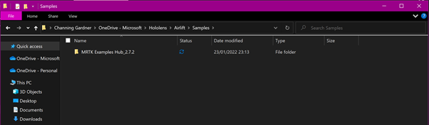  
Figure 1 - Downloaded MRTK Examples Hub sample app  

3)	Inside this folder there are several key components that we will need to deploy the application most importantly the application in the form of an “APPX file”, the security certificate a trusted signature to indicate that the app can be trusted, and finally the dependencies which are components that Intune requires to deploy the app. The HoloLens uses an ARM architecture with the components needed sitting in this folder.

 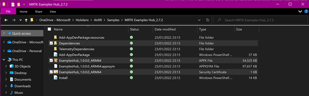  
Figure 2 - MRTK Examples extracted folder featuring components to deploy the sample LOB app  

 
### Deploying the App certificate  

1)	Go the Microsoft Endpoint Manager Admin Center  
   
 
2)	Go to the “Devices” blade. Select “Configuration Profiles”.  
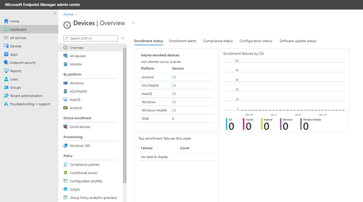  

 
Figure 3 - Devices/Configuration Profiles  
3)	Once you reach the configuration profiles page, Select “Create profile”  
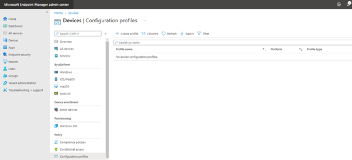  
   
Figure 4 – Devices/Configuration Profile - Create a profile  

4)	Under “Create a profile”, enter the Platform “Windows 8.1 and later” and Profile type “Trusted Certificate”, and Select “Create”.

*NOTE: Equally you can select Windows 10 and later  Templates Trusted Certificate and you will arrive at the same wizard. This when complete it will state that the certificate is for Windows 8.1 and later also.*  

 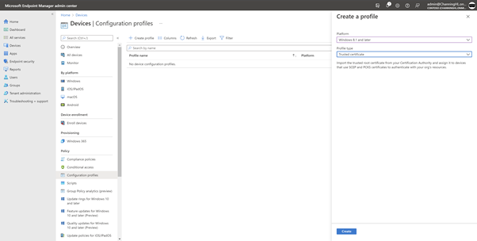  
Figure 5 - Devices/Configuration Profile - Create a profile – Trusted Certiifcate

5)	Follow the wizard which will ask for a name for the Trusted certificate profile, “MRTK Sample certificate”. Select Next.   
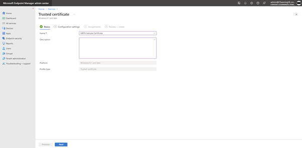  
   
Figure 6 – Configuration Profile/Trusted Certificate Wizard - Name/Description  

6)	For the configuration settings, use the folder button to navigate to the certificate shown in step 3 that was part of our MRTK Examples Hub_2.7.2 package, select the “ExamplesHub_1.0.0.0_ARM64” security certificate file and, click “Open”. 

The setting for Destination store should be…. “Computer certificate store – Root”, then click “Next”.  
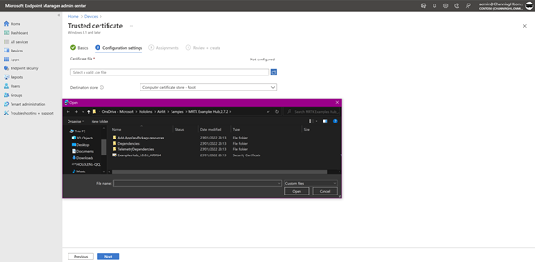  

 
Figure 7 - Configuration Profile/Trusted Certificate Wizard - Certificate File/Destination Store
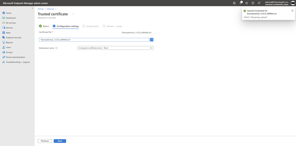  
 
Figure 8 – Configuration profile/Trusted Certificate – Configuration Settings – Certificate file  

*NOTE: A notification will pop up in the upper right corner to indicate a successful upload for the security certificate.*

7)	In Assignments, we can add users and groups who will use the trusted certificate. Click “Add groups”, select the “HoloLens Autopilot Devices” group from the list and Click “Select”. Click “Next”.  
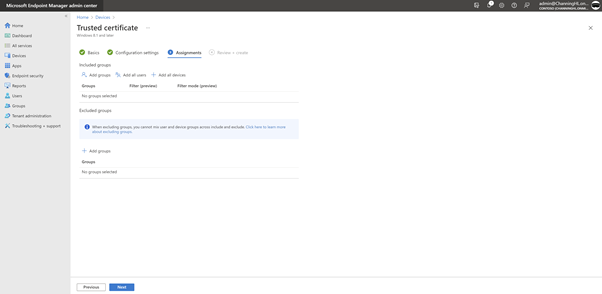  
 
Figure 9 - Configuration profile/Trusted Certificate - Assignments   
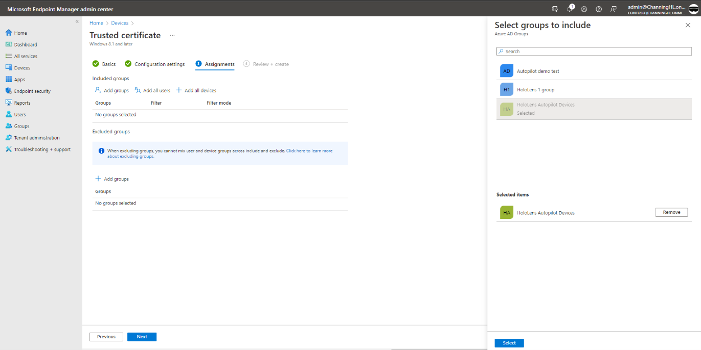  
 
Figure 10 – Configuration profile/Trusted Certificate - Assignments – Select groups to Include
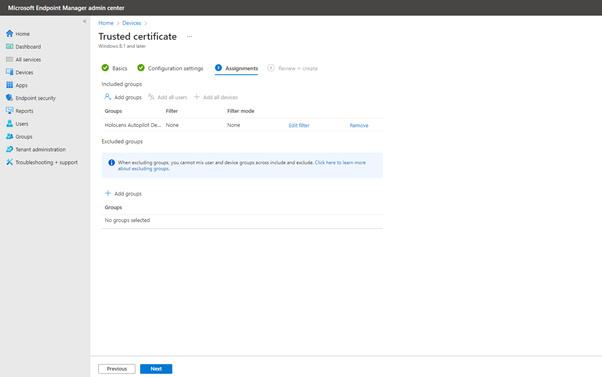  
 
Figure 11 - Configuration profile/Trusted Certificate - Assignments - HoloLens Autopilot Devices  
 
8)	On the Review + Create screen, review the summary of the trusted certificate configuration profile. Select “Create”.  

  
    
 
Figure 12 - Configuration profile/Trusted Certificate – Review + Create (summary screen)  
 
### Uploading an application to Intune

1)	Go to Microsoft Endpoint Manager Admin Center.  
 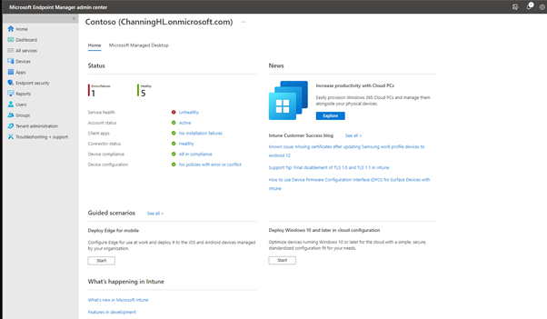  
Figure 13 - Microsoft Endpoint Manager Admin Center  

2)	Go to the “Apps” blade. Select “All apps”, and then “Add”.  
 
 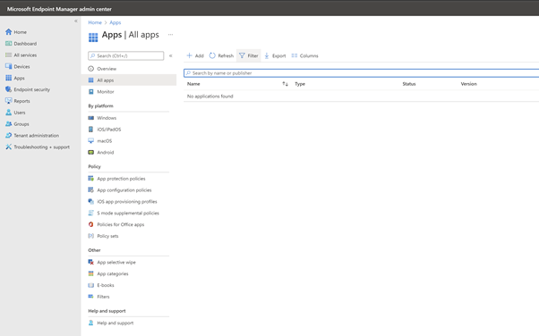  
Figure 14 - Apps/All Apps - Add  

3)	In the Select app type pane, under Other app types, select “Line-of-business app”. Click “Select”.   
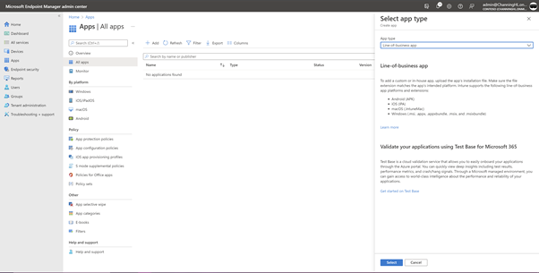  
	 
Figure 15 - Apps/All Apps - Add - Line-of-business app  

4)	In the Add app pane, click “Select app package file”.  
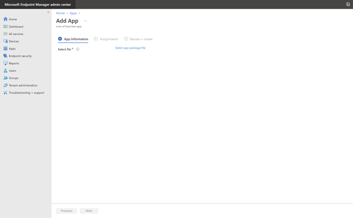  
 
Figure 16 - Apps/All Apps - Add - Line-of-business app, Select app package file  

 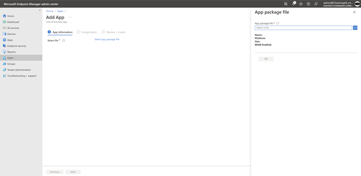  
Figure 17 - Apps/All Apps - Add - Line-of-business app, Select app package file – App package file browse

5)	In the “App package file” pane use the browse file folder button, to navigate to the .appx file in the MRTK Examples Hub_2.7.2 app package we reviewed in step 3 of the preparation section above. Select “Open”.  

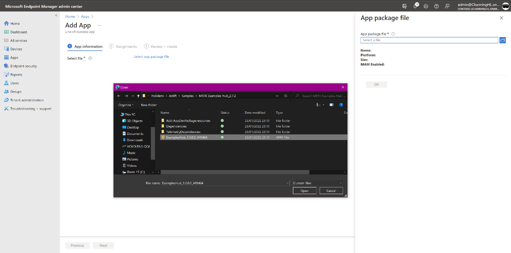  
	 
Figure 18 - Browse File Explorer - Upload appx package file   

6)	Upload the .appx package file and then further dialogue will appear.   
7)	In the “Select dependency app files”, use the browse file folder button to upload the requested dependency file found in the Dependencies folder of the app package MRTK Examples Hub_2.7.2 package. Once selected, click “Open”.  

*NOTE: The dependency file required is the “Microsoft.VCLibs.ARM64.14.00” file in the ARM64 folder, which you can navigate to using the following path*  

- MRTK Examples Hub_2.7.2\Dependencies\ARM64  

It is important to note that there is only 1 file that satisfies both dependencies needed, in this scenario.

8)	Once the files are uploaded, the Added column should reflect “Yes”, then Select “OK”.  

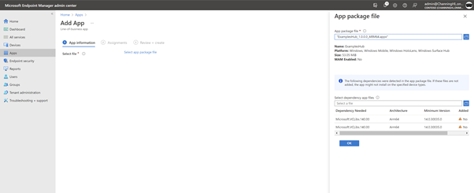    
 
Figure 19 – Uploading appx package file, request for dependency file

 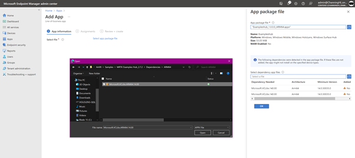    
Figure 20 - Upload dependency file

 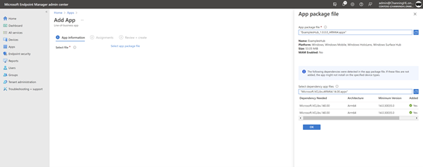  
Figure 21 - Validation of dependency file upload  

9)	This next pane you will be brought to, App information allows you to add key identifying details about the application such as name, description, developer, even associated URLs. Fill in the form with the following or with your own customizations.

| Property | Value |
| --- | --- |
|Name|	ExamplesHub|
|Description|	Sample application to be deployed for test lab.|
|Publisher|	HoloLensLab|
|Category|	Other Apps|

 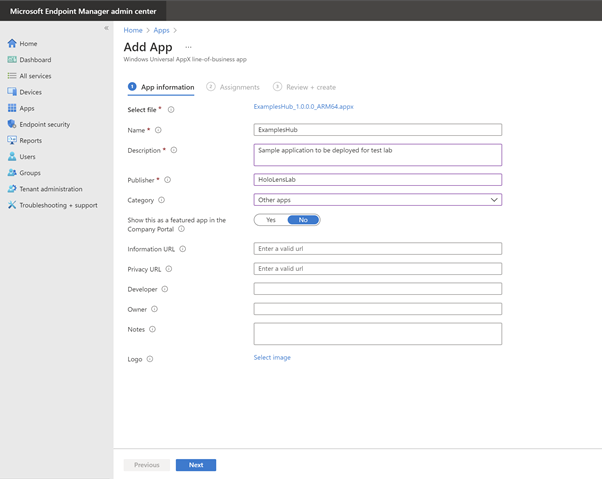    
Figure 22 - App information
 

10)	In Assignments, add a required group i.e. devices, groups and users that will receive this application. Click Add Group, select HoloLens Autopilot Devices under the Select groups pane and click Select.  
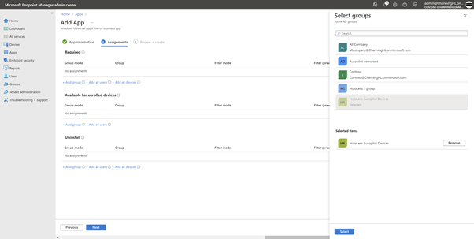  

 
Figure 23 - Select groups pane

11)	Under the Install Context column of the newly assigned group. Click “User Context”. Under the Edit assignment pane, app settings – install context, switch to “Device Context”. Select OK.

 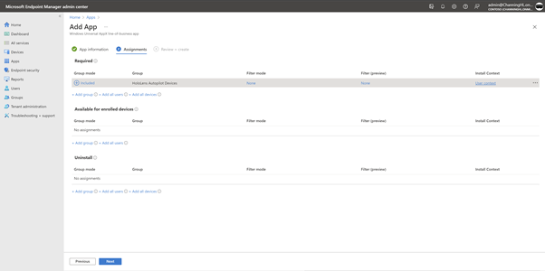    
Figure 24 – Add App – Assignments – HoloLens Autopilot Devices – Install context  
	 
   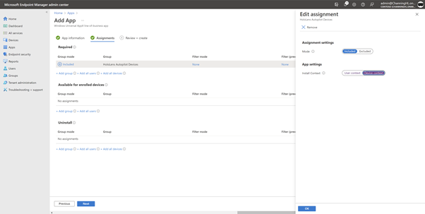    
Figure 25 - Add App – Assignments – HoloLens Autopilot Devices – Install context - Device Context  

12)	On the Review + Create screen, review your settings are as below and Click Create. It will take a little while to deploy the app so check back later.  

	 
 
### Validating a Line Of Business app installation

To validate the installation of the app on the device, log into the HoloLens go to, Settings --> Accounts  Access work or school; select the account then the Info button and scroll down to see different configurations and apps applied to the device from MDM  

To validate the install from Intune go to Apps --> All Apps --> ExamplesHub --> Device Install status page.   

*NOTE: The device will need to connect to Wi-Fi to receive the app.*

