# Welcome to the Mixed Reality MDM Track. 

## Lab 5: Kiosk Mode

In this lab we will set up a single app and multi app kiosk and we will look at the steps that differ between the two.

## Preparation
Before beginning the Kiosk creation piece of this lab we first must set up another Azure AD group. This group will include Azure AD user accounts who will be assigned to the Kiosk experience.

1)	Go to the Azure portal. (portal.azure.com) and log in using your lab credentials. 
 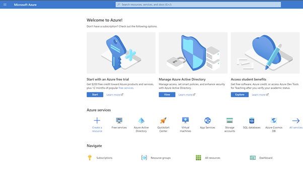  
Figure 1 - Azure Portal
 
2)	Click the View button, under the Manage Azure Active Directory section to specifically go the Azure Active Directory.  Go to the Groups Blade
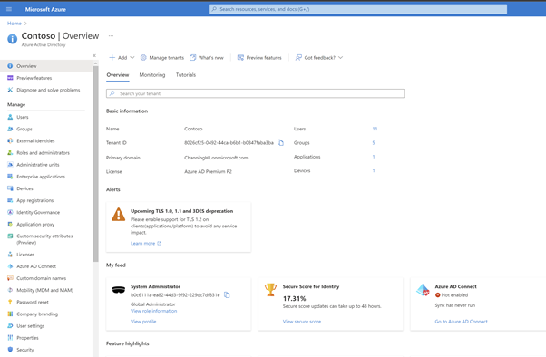  
 
Figure 2 - Azure Active Directory Portal Overview

3)	In All Groups, select New Group.  
 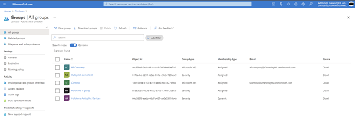  
Figure 3 - Azure AD Groups | All Groups  

4)	On the New Group screen, apply the following selections:-  

|Group Type|	Security|
|---|---|
|Group Name|	HoloLens Lab Users|
|Group Description	|A user group which will be used in the HoloLens demos|
|Azure AD roles can be assigned to the group|	No|
|Membership type|	Assigned|
|Owners|	System Administrator|
|Members|	Alex Wilber, Allen DeYoung, Megan Bowen etc.| 

NOTE: If your custom tenant does not contain pre populated Azure AD user accounts you can follow the steps here to create new accounts to be used as members. 

 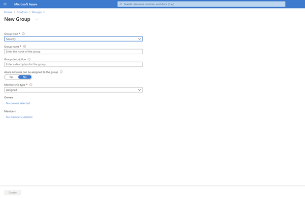  
Figure 4 - Create a New Group

 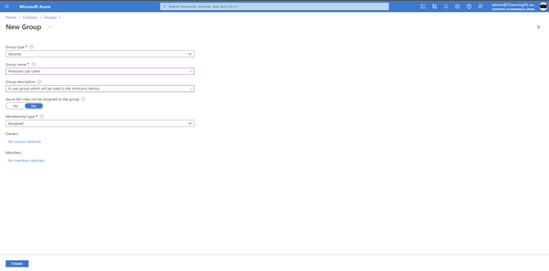  
Figure 5 - New Group – Security & Name  

5)	Under the Owners field, click “No owners selected” search for the System or Global Administrator account, click the account and Click Select.  
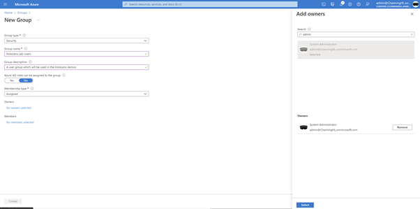  
 
Figure 6 - New Group - Owner  
 
6)	Under the Members field, click “No Members selected” select some users in the tenant e.g. Alex Wilber, Allen DeYoung, Megan Bowen etc, click the accounts and Click Select.
 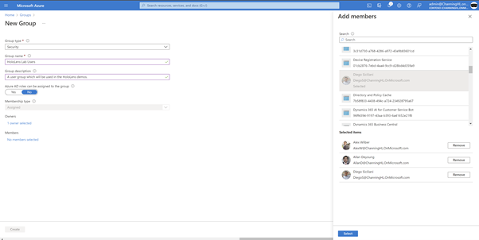  
Figure 7 - New Group – Members

7)	Review the new group settings and Click Create.  
     
Figure 8 - New Group - Final summary

It will take a little while after clicking Create for the Azure AD User Group to appear in Groups| All Groups.

### Microsoft Intune Single App Kiosk with a custom line of business app

1)	Go to Microsoft Endpoint Manager Admin Center. (endpoint.microsoft.com)
   
Figure 9 - Microsoft Endpoint Manager Admin Center

2)	Navigate to the “Devices” blade, then to “Configuration profiles”
   
Figure 10 - Devices blade
 
3)	Click “Create Profile”, set the following properties and Click Create:-

|Platform|	Windows 10 and later|
| ---| ---| 
|Profile type|	Templates|
|Template name|	Kiosk|

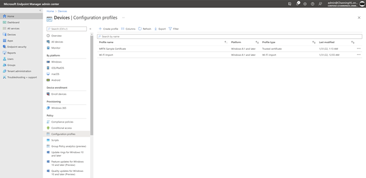  
 
Figure 11 - Devices/Configuration profiles

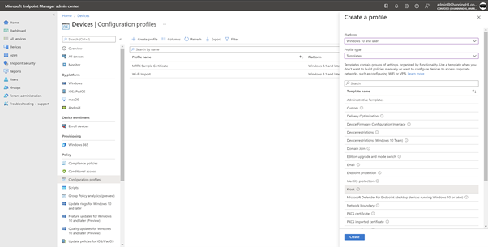  
 
Figure 12 - Devices/Configuration profiles/Create a profile - Kiosk  
 

4)	To set up the Kiosk, we first need to name the Kiosk Profile i.e. “Single App Kiosk”. Add the Description “Single App Kiosk containing the custom line of business app, ExamplesHub” Then click Next.  

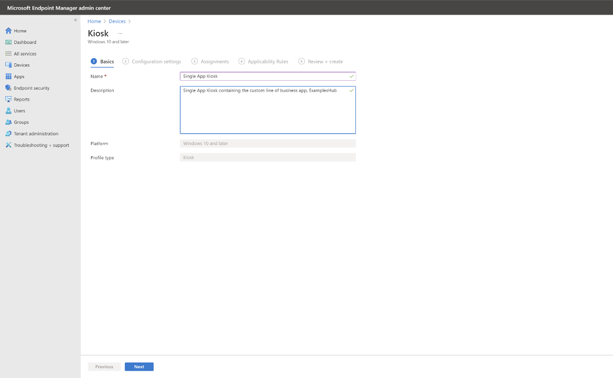   
Figure 13 - Kiosk - Basics  

5)	In Configuration Settings, under Select a kiosk mode select Single app, full screen kiosk and for User logon type select Azure AD user or group (Windows 10, version 1803 and later, or Windows 10, version 1803 and later, or Windows 11). This will trigger further dialogues to make configurations.   

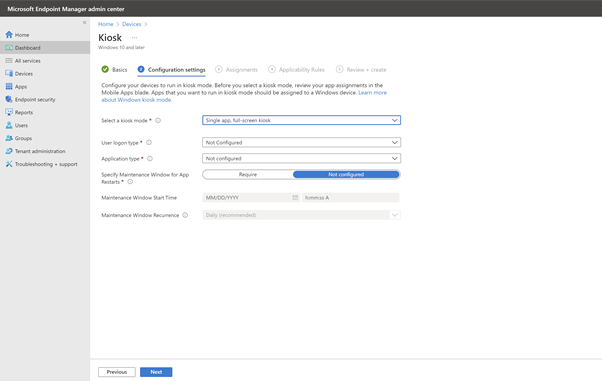  
 
Figure 14 - Kiosk - Configuration Settings - Select a Kiosk mode

 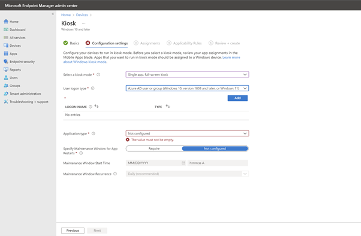  
Figure 15 - User logon type - Azure AD user or group
  
   
6)	To define who the Kiosk experience will be available to click the Add button to select the users and groups to add to the Kiosk. Select any Azure AD user account e.g. System Administrator as the logon for the single app kiosk. Then click Select.  

*NOTE: It is advisable to create a user account to be dedicated to the single app kiosk.*

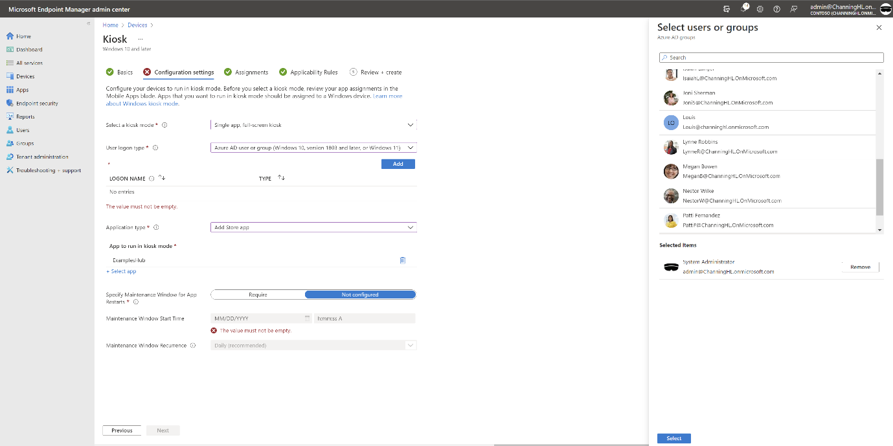     
Figure 16  - Azure AD user or group - Select Users or groups  

7)	Make sure that the Logon name reflects the user account you selected.

8)	For Application Type, select Add Store app. Under the App to run in kiosk mode section click Select app which will load the App to run in kiosk mode pane and populate apps that have been uploaded to the store. The app uploaded in lab 3 will be visible here – ExamplesHub. Select this app and click OK.  
    

 
Figure 17 - Kiosk - App to run in Kiosk mode - add custom app  

9)	Having selected the application this should appear in the section App to run in Kiosk mode as seen below. Keep the setting, Specify Maintenance Window for App Restarts to Not Configured. Click Next.  
 

10)	In Assignments, click Add groups. The Select groups to include select the HoloLens Autopilot Devices group. Click Select.  
    
Figure 18 - Kiosk - Select groups to include

    

  

Figure 19 - Kiosk - Review Assignments  

11)	 Skip the Applicability Rules pane. Click Next.  

*Note: If wanted to only apply these settings to a subset of devices you could create a Rule with specific properties in this pane.*   

  
    

Figure 20 - Kiosk - Applicability Rules

12)	Review the final configuration on the summary page and click Create.  

### Multi App Kiosk with several apps including a custom line of business app

1)	Go to Microsoft Endpoint Manager Admin Center. (endpoint.microsoft.com)
   
Figure 21 - Microsoft Endpoint Manager Admin Center

2)	Navigate to the “Devices” blade, then to “Configuration profiles”
 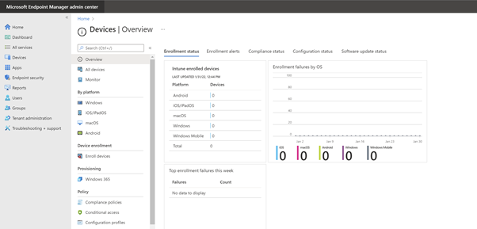  
Figure 22 - Devices blade

  
3)	Click “Create Profile”, set the following properties and Click Create:-  

|Platform|	Windows 10 and later|
| --- | --- | 
|Profile type|	Templates|
|Template name|	Kiosk|

  

 
Figure 23 - Devices/Configuration profiles  
   

 
Figure 24 - Devices/Configuration profiles/Create a profile - Kiosk  

4)	To set up the Kiosk, we first need to name the Kiosk Profile i.e. “Multi App Kiosk”. Add the Description “Multi App Kiosk containing the custom line of business app, ExamplesHub and some in box applications” Then click Next.  

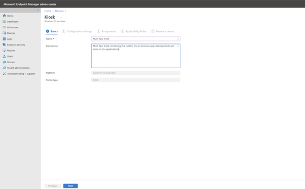   
 
Figure 25 - Kiosk - Multi App Kiosk – Basics  

5)	In Configuration Settings, apply the following settings:-  

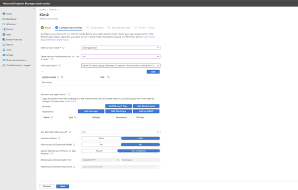  

|Select a kiosk mode|	Multi app kiosk|
|---|---|
|Target devices running Windows 10/11 in S mode|	No|
|User logon type|	Azure AD user or group (Windows 10, version 1803 and later, or Windows 10, version 1803 and later, or Windows 11)|

Once the user logon type has been selected, click Add. This will trigger further dialogues to make configurations. 

 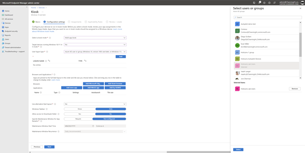    
Figure 26 - Kiosk - Configuration settings - Multi app kiosk  

6)	From the Select users or groups pane, select the HoloLens Lab Users group. Click Select.  
	 
7)	Review the LOGON NAME section to confirm that the correct Azure AD user group has been added.  

8)	Under Browsers and Applications, click Add by AUMID. HoloLens Application User Model IDs (AUMIDs) are used to identify applications and add applications to Kiosks. For a full list of in-box app AUMIDs see [HoloLens kiosk reference information | Microsoft Docs.](https://docs.microsoft.com/en-us/hololens/hololens-kiosk-reference)

Use the following details to fill the Application Names and Application user model ID (AUMID) fields. 

|Application Name	|Application user model (AUMID) for the Win32 app|
| --- | --- |
|Dynamics 365 Remote Assist	|Microsoft.MicrosoftRemoteAssist_8wekyb3d8bbwe!Microsoft.RemoteAssist|
|OneDrive	|microsoft.microsoftskydrive_8wekyb3d8bbwe!App|

After completing the process for Dynamics 365 Remote Assist click OK.

     
Figure 27 - Kiosk - Add by AUMID app - Remote Assist (RA)  

  
9)	Repeat step 8 and use the details for OneDrive. Click OK.  
  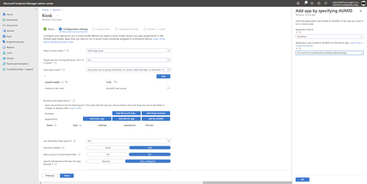   
Figure 28 - Kiosk - Add by AUMID app – OneDrive  

10)	In the same Browsers and Applications section, click Add store app. Select the ExamplesHub app from the populated list, click OK.   

 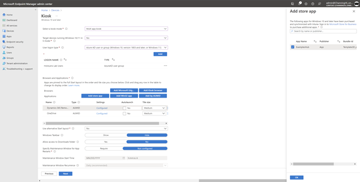   
Figure 29 - Kiosk - Multi app kiosk - Add store app  

11)	Review the 3 apps in the Browsers and Applications section. Make sure that the Autolaunch checkbox for each of these apps is set to No. The tile size should be Medium.  

12)	For the “Use alternative start layout”, “Windows taskbar” and “Allow access to downloads folder”, keep the default selections.

13)	For the “Specify maintenance Window for App Restarts” move the toggle to Require. The Maintenance Window Start Time should be today’s date and set the time to 05:00:00 AM.

14)	For “Maintenace Window Recurrence” leave the default selection of Daily (recommended).
Click Next.

   
Figure 30 - Kiosk - Multi app kiosk - Review Configuration Settings    

15)	In Assignments, click Add groups. From the Select groups to include, choose the HoloLens Autopilot Devices group. Click Select.  
  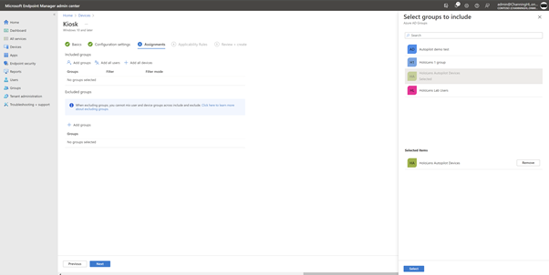 

Figure 31 - Kiosk - Multi app kiosk – Assignments  

16)	Review the group that the kiosk will be assigned to and click Next.
  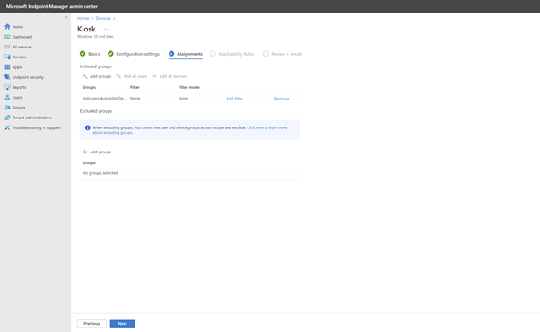  

Figure 32 - Kiosk - Multi app kiosk – Assignments review

17)	Skip the Applicability Rules pane. Click Next. 

*Note: If wanted to only apply these settings to a subset of devices you could create a Rule with specific properties in this pane.*
 
  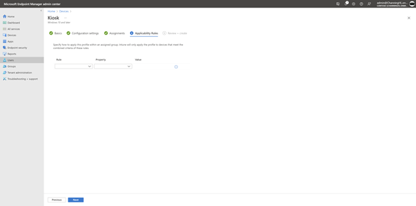  

Figure 33 - Kiosk - Multi app kiosk – Applicability Rules

18)	On the Review + Create pane, review the settings of the configuration profile. If correct, click Create.

 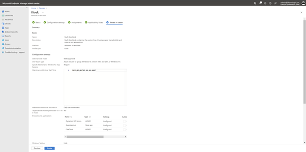   
 
Figure 34 - Kiosk - Multi App Kiosk - Review Summary part 1

  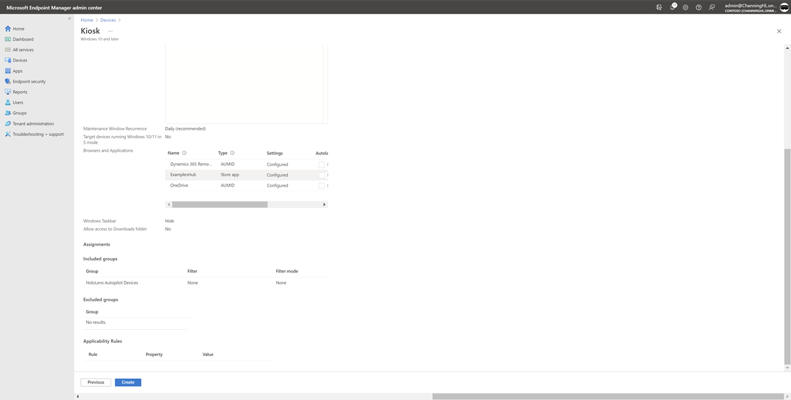   
Figure 35 - Kiosk - Multi App Kiosk - Review Summary part 2

