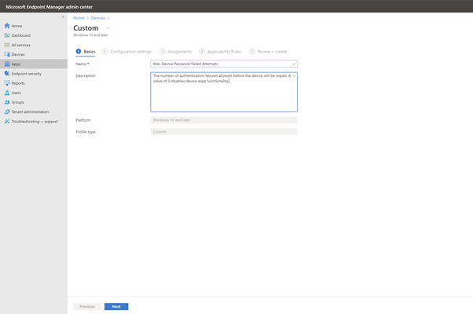
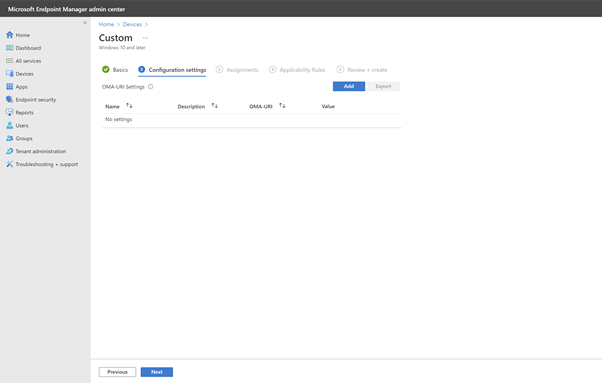
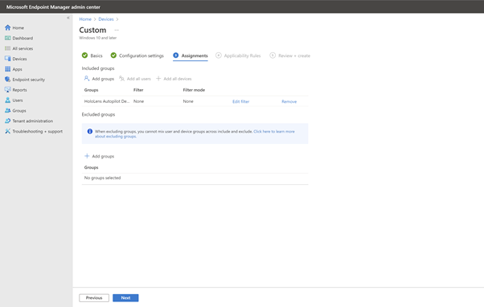

# Welcome to the Mixed Reality MDM Track. 

## Lab 4: Implementing settings with CSP's

In Windows 10, Configuration Service Providers (CSP)s are an interface to read, set, modify, or delete configuration settings on the device.

Find the full list of HoloLens CSPs [here](https://docs.microsoft.com/en-us/windows/client-management/mdm/configuration-service-provider-reference#csps-supported-in-hololens-devices)

Within this guide we will attempt to implement a setting

•	Policy CSP - DeviceLock/MaxDevicePasswordFailedAttempts  

1)	Go to Microsoft Endpoint Manager Admin Center. (endpoint.microsoft.com)

   
Figure 1 - Microsoft Endpoint Manager Admin Center  

2)	Navigate to the “Devices” blade, then to “Configuration profiles”  

    
Figure 2 - Devices blade  

### Create a configuration profile using the custom template to configure CSPs

#### Policy CSP – Device Lock – Max Device Password Failed Attempts
Link to CSP - DeviceLock/MaxDevicePasswordFailedAttempts

12)	Click “Create Profile”, set the following properties and Click Create:-  

|Platform|	Windows 10 and later|
| ---|---|
|Profile type|	Templates|
|Template name|	Custom|

Using the custom template we can configure a number of CSPs that can be used together, independently and with a number of devices.  

    
Figure 3 - Devices/Configuration profiles  

     
Figure 4 - Devices/Configuration profiles/Create a profile – Custom

13)	Using the Custom template, in the basics pane input the following, then click Next :-  

|Name|	Max Device Password Failed Attempts|
| --- | ---| 
|Description|	The number of authentication failures allowed before the device will be wiped. A value of 0 disables device wipe functionality.|

     
Figure 5 - Custom template – Basics  (Max Device Password Failed Attempts)  

14)	In Configuration settings, click Add.  

     
Figure 6 – Custom template - Configuration settings  

15)	In the Add Row pane, use the following table to input the fields :-  

|Name	|Max Device Password Failed Attempts|
|---|---|
|Description|	-|
|OMA-URI|	./Device/Vendor/MSFT/Policy/Config/DeviceLock/MaxDevicePasswordFailedAttempts|
|Data Type|	Integer|
|Value	|4|

Then click Save. 

NOTE: For Policy CSPs we follow the format to configure the policy :- 

•	./Device/Vendor/MSFT/Policy/Config/AreaName/PolicyName 

In the example above AreaName = “DeviceLock” and PolicyName = “MaxDevicePasswordFailedAttempts”.

   
Figure 7 - Custom template, Add Row, OMA-URI Settings  

16)	Review the configuration settings, that have been added to this profile. If they are correct click Next.
Note: When implementing for a customer multiple settings can be added here.  

    	 
Figure 8 - Custom - Max Device Password Failed – summary  

17)	In Assignments, click Add groups. On the Select groups to include pane, select the HoloLens Autopilot Devices group and then click Select.  

    
	 
Figure 9 - Custom - Assignments - HoloLens Autopilot Devices  

18)	Review the added group under Included groups. Click Next.

     
Figure 10 - Custom - Assignments review groups  
 

19)	Skip the Applicability Rules pane. Click Next.  

*Note: If wanted to only apply these settings to a subset of devices you could create a Rule with specific properties in this pane.*

     
Figure 11 - Custom - Applicability Rules  

 
20)	Review the Custom profile settings and if correct click Create.

   
Figure 12 - Custom - Review + create

