# Welcome to the Mixed Reality MDM Track. 

## Lab 4: Implementing settings with CSP's

In Windows 10, Configuration Service Providers (CSP)s are an interface to read, set, modify, or delete configuration settings on the device.

Find the full list of HoloLens CSPs [here](https://docs.microsoft.com/en-us/windows/client-management/mdm/configuration-service-provider-reference#csps-supported-in-hololens-devices)

Within this guide we will attempt to implement a few different settings

•	Policy CSP - DeviceLock/MaxDevicePasswordFailedAttempts  
•	Tenant Lockdown CSP  

1)	Go to Microsoft Endpoint Manager Admin Center. (endpoint.microsoft.com)

   
Figure 1 - Microsoft Endpoint Manager Admin Center  

2)	Navigate to the “Devices” blade, then to “Configuration profiles”  

    
Figure 2 - Devices blade  

### Create a configuration profile using the custom template to configure CSPs

#### MSFT Tenant Lockdown CSP  

3)	Click “Create Profile”, set the following properties and Click Create:-  

|Platform| 	Windows 10 and later|
| --- | ---| 
|Profile type|	Templates|
|Template name|	Custom| 

Using the custom template we can configure a number of settings each of our CSPs in the list provided at the beginning of the document. 

   
Figure 3 - Devices/Configuration profiles

 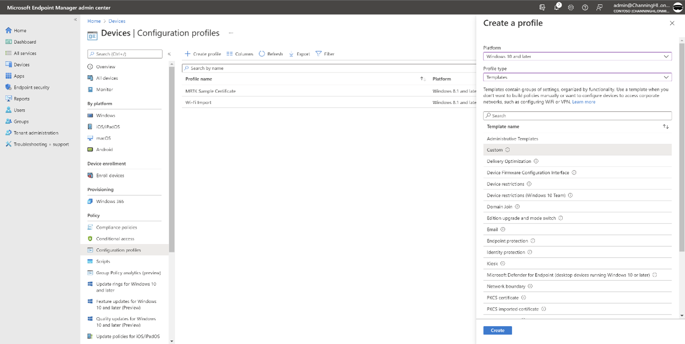    
Figure 4 - Devices/Configuration profiles/Create a profile - Custom  

The following steps can be used for all the CSPs managed in this way. 

4)	Using the Custom template, in the basics pane input the following, then click Next :-  

|Name|	Tenant Lockdown CSP|
| --- | ---| 
|Description|	Locks a device to a tenant, and ensures that the device remains bound to the tenant in case of accidental or intentional resets or wipes.|

    
 
Figure 5 - Custom template – Basics  (Tenant Lockdown CSP)  

5)	In Configuration settings, click Add. 

     
Figure 6 – Custom template - Configuration settings  

6)	In the Add Row pane, use the following table to input the fields :-  

|Name|	Tenant Lockdown|
| --- | ---| 
|Description|	-|
|OMA-URI|	./Vendor/MSFT/TenantLockdown/RequireNetworkInOOBE|
|Data Type|	Boolean|
|Value|	True|

Then click Save. 
 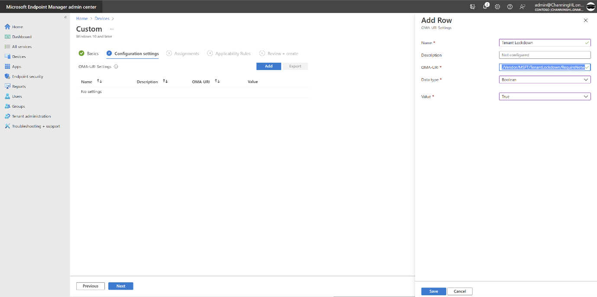    
Figure 7 - Custom template, Add Row, OMA-URI Settings

7)	Review the configuration settings, that have been added to this profile. If they are correct click Next.
Note: When implementing for a customer multiple settings can be added here.  
 
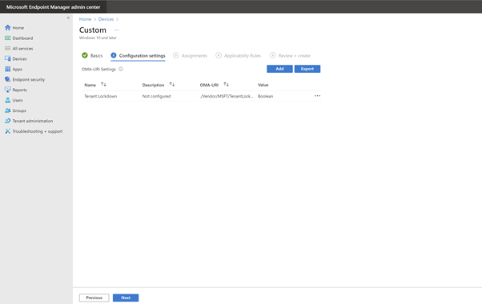    

 
Figure 8 - Custom template, Configuration settings summary  

8)	In Assignments, click Add groups. On the Select groups to include pane, select the HoloLens Autopilot Devices group and then click Select.  
    
Figure 9 - Custom - Assignments - HoloLens Autopilot Devices  

9)	Review the added group under Included groups. Click Next.

     
Figure 10 - Custom - Assignments review groups  

10)	Skip the Applicability Rules pane. Click Next.   

*Note: If wanted to only apply these settings to a subset of devices you could create a Rule with specific properties in this pane.*

 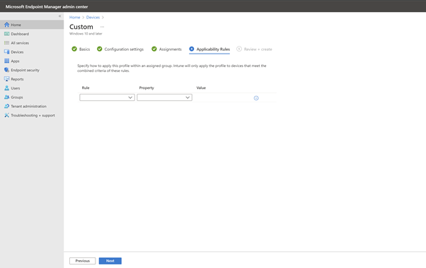   
Figure 11 - Custom - Applicability Rules  

11)	Review the Custom profile settings and if correct click Create.  
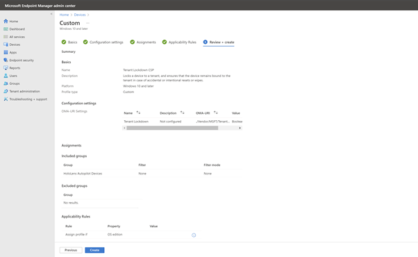  
 
Figure 12 - Custom - Review + create

#### Policy CSP – Device Lock – Max Device Password Failed Attempts
Link to CSP - DeviceLock/MaxDevicePasswordFailedAttempts

12)	Click “Create Profile”, set the following properties and Click Create:-  

|Platform|	Windows 10 and later|
| ---|---|
|Profile type|	Templates|
|Template name|	Custom|

Using the custom template we can configure a number of CSPs that can be used together, independently and with a number of devices.  

    
Figure 13 - Devices/Configuration profiles  

     
Figure 14 - Devices/Configuration profiles/Create a profile – Custom

13)	Using the Custom template, in the basics pane input the following, then click Next :-  

|Name|	Max Device Password Failed Attempts|
| --- | ---| 
|Description|	The number of authentication failures allowed before the device will be wiped. A value of 0 disables device wipe functionality.|

     
Figure 15 - Custom template – Basics  (Max Device Password Failed Attempts)  

14)	In Configuration settings, click Add.  

     
Figure 16 – Custom template - Configuration settings  

15)	In the Add Row pane, use the following table to input the fields :-  

|Name	|Max Device Password Failed Attempts|
|---|---|
|Description|	-|
|OMA-URI|	./Vendor/MSFT/Policy/Config/DeviceLock/MaxDevicePasswordFailedAttempts|
|Data Type|	Integer|
|Value	|4|

Then click Save. 

NOTE: For Policy CSPs we follow the format to configure the policy :- 

•	./Vendor/MSFT/Policy/Config/AreaName/PolicyName 

In the example above AreaName = “DeviceLock” and PolicyName = “MaxDevicePasswordFailedAttempts”.

 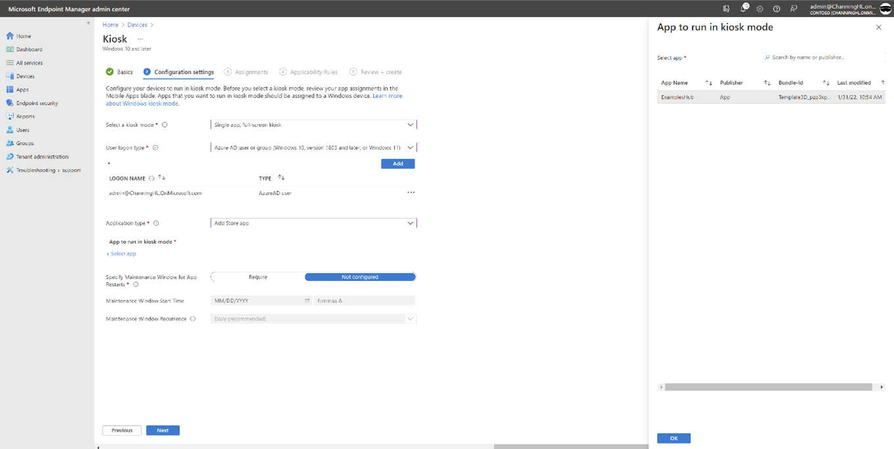  
Figure 17 - Custom template, Add Row, OMA-URI Settings  

16)	Review the configuration settings, that have been added to this profile. If they are correct click Next.
Note: When implementing for a customer multiple settings can be added here.  

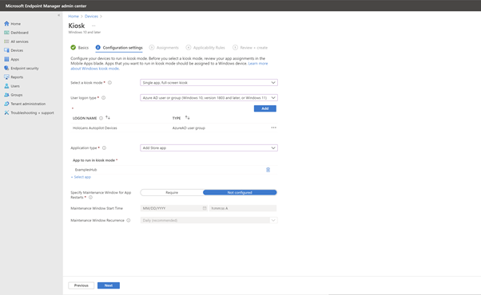    	 
Figure 18 - Custom - Max Device Password Failed – summary  

17)	In Assignments, click Add groups. On the Select groups to include pane, select the HoloLens Autopilot Devices group and then click Select.  

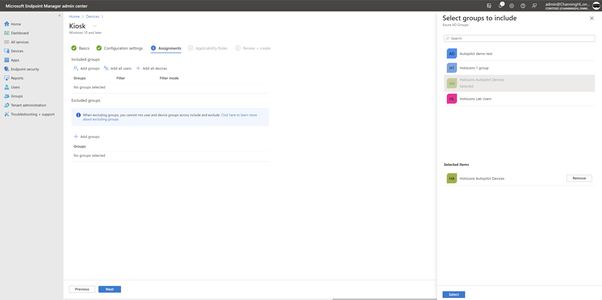    
	 
Figure 19 - Custom - Assignments - HoloLens Autopilot Devices  

18)	Review the added group under Included groups. Click Next.

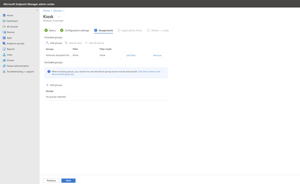     
Figure 20 - Custom - Assignments review groups  
 

19)	Skip the Applicability Rules pane. Click Next.  

*Note: If wanted to only apply these settings to a subset of devices you could create a Rule with specific properties in this pane.*

 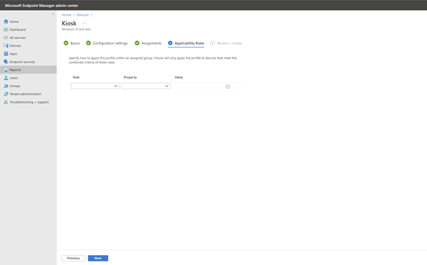    
Figure 21 - Custom - Applicability Rules  

 
20)	Review the Custom profile settings and if correct click Create.

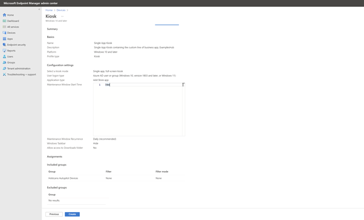   
Figure 22 - Custom - Review + create

