# HoloLens MDM Hands on Lab – Preparation

## Requirements

To complete the hands on lab, you will need:   
1.	An M365 Tenancy configured with at least
 M365 E3 (AADP1, Intune, at a minimum)
2.	A HoloLens Device

## Preparation

AutoPilot registration can take up to 24 hours to flow through the AAD environments, so to enable the hands-on lab, completing these steps after the 101 training is recommended.   
There are 3 key tasks to prepare for autopilot. 
1.	Obtain Hardware Hash of HoloLens Device
2.	Create AAD Group for AutoPilot Devices
3.	Assign and AutoPilot profile to the HoloLens device.

### Obtain Hardware Hash
1.	Reset your HoloLens Device to Factory Settings. This can be achieved by following the steps at: https://docs.microsoft.com/en-us/hololens/hololens-recovery#clean-reflash-the-device
2.	It would be recommended to use the ARC tool to update the device aswell, as this will provide the latest General Available build for the HoloLens.
3.	Obtain the Hardware Hash following the steps at https://docs.microsoft.com/en-us/hololens/hololens2-autopilot#obtain-hardware-hash
4.	Register your device in Intune following the steps at https://docs.microsoft.com/en-us/hololens/hololens2-autopilot#register-device-through-mem
5.	Set the “Group Tag” to “HoloLens”

### Create AAD Group for HoloLens Devices  
   
1.	Go to the Azure Portal, portal.azure.com, navigate to Azure Active Directory
 
 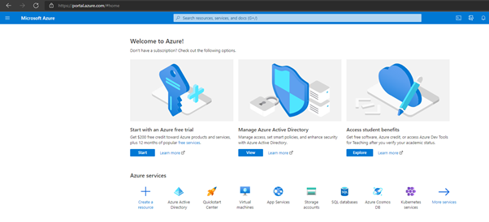  
Figure 1 - Azure Portal  
 
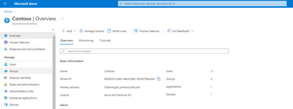  
Figure 2 - Azure Portal/Azure Active Directory/Groups  
  
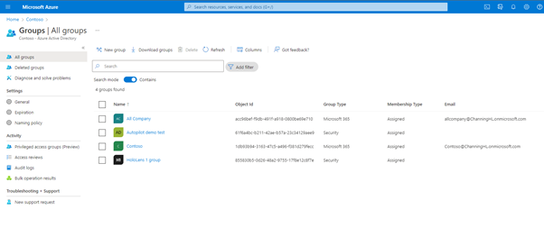   
Figure 3 - Here is where to create and find all your Azure Active Directory Groups in the tenant  

**NOTE: For the purposes of this set up we will be using dynamic enrollment to add all our HoloLens devices to a device security group.**

2.	Create a new Dynamic Security group called “HoloLens AutoPilot Devices”

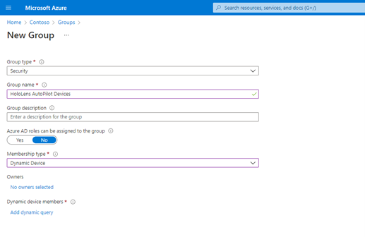   
Figure 4 - Groups/New Group - selecting Dynamic Device  

3.	Select Add dynamic query.

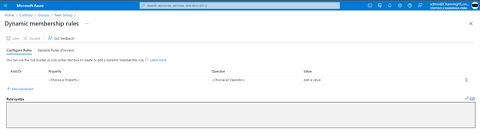

Figure 5 - Groups/New Group Add Dynamic query/Dynamic membership rules  

4.	Select Edit at the end of the Rule Syntax box  

5.	Within the rules syntax box, use the following membership rule
a.	(device.devicePhysicalIds -any (_ -eq "[OrderID]:HoloLens"))

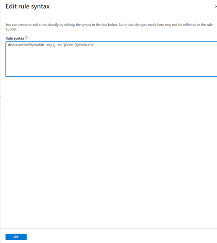   
Figure 6 - Edit Rule Syntax box
 
 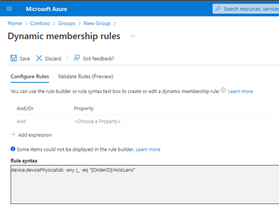  
Figure 7 - Dynamic Membership rules - Save

6.	Hit OK, Go back to the previous page where you can select Save and wait for the group membership to be updated.

### Create and Assign AutoPilot Profile to the device.    

1.	Open Endpoint Manager (endpoint.microsoft.com),   
   
Figure 8 - Endpoint Manager admin portal
2.	Navigate to the “Devices” blade then select “Enroll Devices”. 
 
   
Figure 9 - Endpoint manager admin portal  Devices

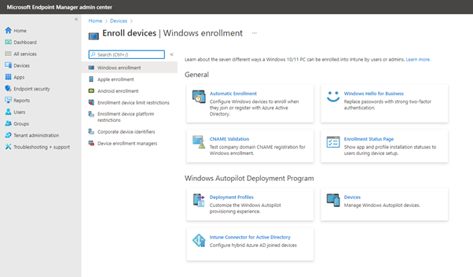  
 
Figure 10: Endpoint Manager admin portal  Devices/Enroll Devices/Automatic Enrollment

3.	Within the Devices – Windows – Windows Enrollment – Automatic enrolment, set the MDM User Scope to “All”
 
 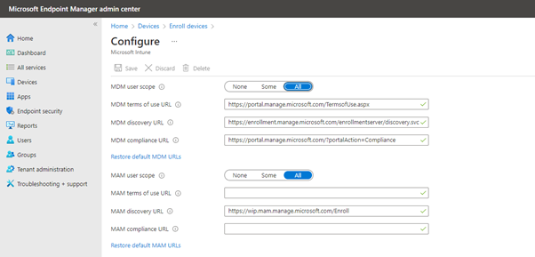  
Figure 11: Endpoint Manager Admin Portal   Devices/Enroll devices/Automatic Enrollment - Configure

4.	Navigate to the Devices – Windows – Windows Enrolment – Enrollment Status Page

 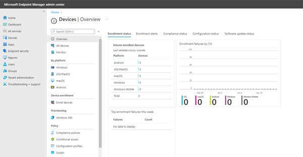  
Figure 12: Endpoint Manager Admin Portal  Devices/Enroll devices

   
Figure 13 - Endpoint Manager Admin Portal  Devices/Windows/Windows Enrollment/Enrollment Status Page

a.	Configure the page as the following: 

 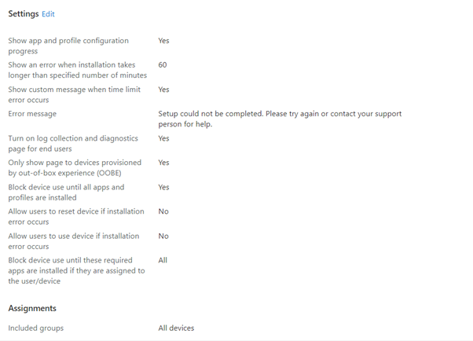  
Figure 14 - Enrollment Status Page Settings  
 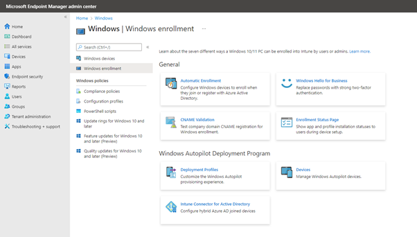  
Figure 15 - Endpoint Manager Admin Portal  Devices/Windows/Windows Enrollment/Deployment Profiles
   
Figure 16 - Endpoint Manager Admin Portal  Devices/Enroll Devices/ Deployment Profiles --> Create Profile

   
Figure 17 - Endpoint Manager Admin Portal  Devices/Enroll Devices/ Deployment Profiles --> Create Profile/HoloLens
 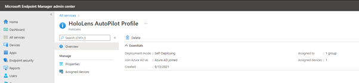  
Figure 18 - HoloLens AutoPilot profile summary  

a.	Within the AutoPilot Deployment Profiles section, create a HoloLens deployment profile within the following settings:  

| Setting | Configuration | Justification |
| --- | --- | --- |
| Name | HoloLens AutoPilot Profile |Name for the policy.|  
| Device Type  |HoloLens	 |Required
| Deployment Mode |	Self-Deploying (Preview) |	Required |
| Join to Azure AD As |	Azure AD Joined |	Required |
| Language (Region) |Operating System Default |Retains Defaults. Could be changed if multi language is a requirement  |
| Automatically configure Keyboard |	Yes|	
Microsoft Software License Terms |	Hide | 	Required
| Hide Change Account Options |	Hide |	Required|
| Privacy Settings |Hide |Required
| Apply Device Name Template| Yes |	To create a naming convention for the devices
| Enter a Name |MSFT-%RAND%	| To create a naming convention for the devices |
| Assignment 
| Include | HoloLens AutoPIlot Devices |	To apply to all HoloLens Devices | 

The following is an example of how your properties could look in the portal:-

 
Figure 20 - AutoPilot deployment profile properties

**You want to make sure that when you assign this profile you got to the Included groups and you select the group you created**

### Validation
Within the Windows Autopilot Devices tab, validate that your device says has a profile status of “Assigned”. This may take up to 24 hours to show. 

Please visit the link below for what Autopilot looks like when run on your device. https://docs.microsoft.com/en-us/hololens/hololens2-autopilot#windows-autopilot-for-hololens-2-user-experience

To delete an autopilot profile see instructions here. https://docs.microsoft.com/en-us/mem/autopilot/add-devices#delete-autopilot-devices

